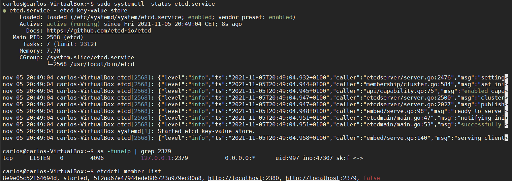
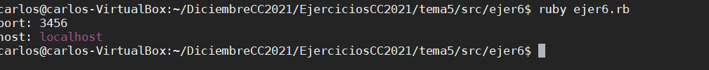
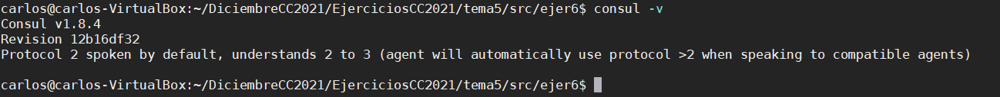
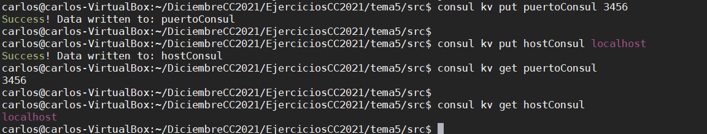
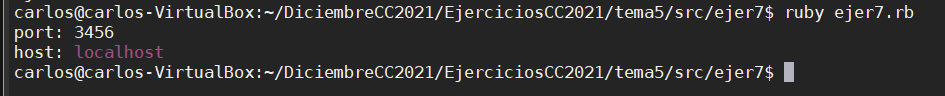

## Ejercicio 1. Realizar una aplicación básica que use algún microframework para devolver alguna estructura de datos del modelo que se viene usando en el curso u otra que se desee. La intención de este ejercicio es simplemente que se vea el funcionamiento básico de un microframework, especialmente si es alguno que, como express, tiene un generador de código. Se puede usar, por otro lado, el lenguaje y microframework que se desee.
Para este ejercicio se va a usar el lenguaje ruby que es el que se usa en la aplicación de la asignatura, para realizar la aplicación básica se va a usar la gema sinatra de ruby. Es uno de los microframework que se pueden usar en ruby tal y como se comenta [aquí](https://www.slant.co/topics/3523/~best-ruby-microframeworks).

En este caso vamos a devolver la estructura de datos que se usa como prueba para el proyecto de la asignatura, esta estructura esta en formato json y viene definida de la siguiente forma como vemos en la siguiente imagen y en el [fichero](https://github.com/CharlySM/EjerciciosCC2021/blob/main/tema5/src/estructura.json).


Comprobamos desde la consola que se estan mandando las peticiones.


Comprobamos que funciona desde el navegador.


La api desarrollada se puede ver [aquí](https://github.com/CharlySM/EjerciciosCC2021/tree/main/tema5/src/ejer1).

##  Ejercicio 2. Programar un microservicio en express (o el lenguaje y marco elegido) que incluya variables como en el caso anterior.

Para este ejercicio vamos a autilizar la aplicación usada en el ejercicio anterior. Como ya tenemos creado una petición GET vamos a mantener esta petición y vamos a crear una nueva con post. Para esta petición vamos a añadir datos a nuestro fichero json del cual leemos datos con el get.

Para mandar la petición post hemos creado un formulario en el fichero index para mandar esta petición donde el único valor que se modifica sera el valor del equipo, el resto de valores se han escondido y añadido de forma aleatoria para ver el funcionamiento de la petición post.

Una vez que hemos ejecutado vemos el resultado de la ejecución.


La nueva ruta se ha añadido en el fichero [index.rb.](https://github.com/CharlySM/EjerciciosCC2021/blob/main/tema5/src/ejer1/index.rb) Es una petición post con ruta ```/added```.

Formulario de añadido del ejercicio 2.


## Ejercicio 3. Crear pruebas para las diferentes rutas de la aplicación.

Para pasar las pruebas de las rutas hemos hecho pruebas para la ruta get y post creadas en el ejericio anterior. Para estas pruebas se ha usado la gema **rack-test** de ruby que nos permíte hacer pruebas sobre las rutas creadas.

Para ello hemos creado un fichero de test específico para las pruebas, llamado [Routes_test](https://github.com/CharlySM/EjerciciosCC2021/blob/main/tema5/src/ejer1/test/Routes_test.rb).

Aquí podemos ver una ejecución de las pruebas de las rutas.


## Ejercicio 4. Experimentar con diferentes gestores de procesos y servidores web front-end para un microservicio que se haya hecho con antelación, por ejemplo en la sección anterior.

Como gestor de procesos para ruby podemos encontrar varios si buscamos en internet. Los visto han sido passenger, foreman y procman, el más fácil de usar y que tiene mas documentación es procman por lo que se ha elegido este gestor.

Este gestor usa un fichero llamado Procfile para configurar sus tareas y hacer lo que se ordene. Para probar nuestro gestor se ha creado un Procfile con dos tareas, una para iniciar nuestra app y otra para parar nuestra app. El fichero Procfile podemos verlos [aquí](https://github.com/CharlySM/EjerciciosCC2021/tree/main/tema5/src/ejer1/Procfile). Para ejecutar una tarea del gestor lo que hacemos es ejecutar el comando ```procman tarea --processes nombreProceso```.

Aquí vemos una captura de las ejecuciones de las tareas del gestor.


## Ejercicio 5. Usar rake, invoke o la herramienta equivalente en tu lenguaje de programación para programar diferentes tareas que se puedan lanzar fácilmente desde la línea de órdenes un microservicio.

Para este ejercicio vamos a crear dos tareas en el fichero Rakefile, una donde lanzaremos la app desde linea de órdenes y otra que lanzaremos con procman. Usaremos la app que se ha venido usando en estos ejercicios.

Las tareas a lanzar son:
1. exec: Ejecución de la aplicación con gestor de tareas.
2. start: Ejecución de la aplicación usando procman.
3. stop: Parar la aplicación usando procman.

Fichero [Rakefile.](https://github.com/CharlySM/EjerciciosCC2021/blob/main/tema5/src/ejer1/Rakefile)

Imagen ejecución de tareas.


## Ejercicio 6. Instalar etcd3, averiguar qué bibliotecas funcionan bien con el lenguaje que estemos escribiendo el proyecto (u otro lenguaje), y hacer un pequeño ejemplo de almacenamiento y recuperación de una clave; hacer el almacenamiento desde la línea de órdenes (con etcdctl) y la recuperación desde el mini-programa que hagáis.

Para usar la configuración distirbuida se ha usado el servicio etcd. Para usarlo primero se ha tenido que instalar siguiendo [esta](https://computingforgeeks.com/how-to-install-etcd-on-ubuntu-18-04-ubuntu-16-04/) guía.

Una vez instalado verificamos su estado con los comandos.

```
systemctl status etcd.service
```

Lanzamos el servicio en el puerto 2379.

```
ss -tunelp | grep 2379
```

Coprobamos que se ha lanzado.

```
etcdctl member list
```
 Mostramos la ejecución de los comandos lanzados anteriormente.

 

 Realizamos el export para que funcione correctamente el cliente.

 ```
 export ETCDCTL_API=3
 ```

Creamos el puerto y host para nuestra aplicación.

```
etcdctl put PortApp 3456
etcdctl put HostApp localhost
```
El fichero del programa se encuentra [aquí.](https://github.com/CharlySM/EjerciciosCC2021/blob/main/tema5/src/ejer6/ejer6.rb)

Ejecución del programa.



## Ejericio 7. Instalar consul, averiguar qué bibliotecas funcionan bien con el lenguaje que estemos escribiendo el proyecto (u otro lenguaje), y hacer un pequeño ejemplo de almacenamiento y recuperación de una clave desde la línea de órdenes.

Para la instalación de consul, podemos seguir las instrucciones de su [página web](https://learn.hashicorp.com/tutorials/consul/get-started-install?in=consul/getting-started)

Una vez instalado verificamos, comprobando la versión, por ejemplo.



Una vez verificado, necesitamos ejecutar el agente para poder empezar a trabajar con consul.

```consul agent -dev```

Para detener el agente debemos ejecutar:

```consul leave```

La libreria a usar con el lenguaje de programación usado para el proyecto es [diplomat](https://github.com/WeAreFarmGeek/diplomat).

Como ejemplo, vamos a crear el puerto y el host y lo vamos a recuperar desde una pequeña aplicación en ruby.

Para crear las claves con el puerto y el host ejecutamos lo siguiente:

```
consul kv put puertoConsul 3456

consul kv put hostConsul localhost

# Para recuperar las claves desde ejecutamos

consul kv get puertoConsul

consul kv get hostConsul
```

Podemos ver una ejecución de los comandos anteriores a continuación.



Ahora creamos un pequeño programa en ruby para mostrar las claves creadas antes.

El fichero del programa se encuentra [aquí.](https://github.com/CharlySM/EjerciciosCC2021/blob/main/tema5/src/ejer7/ejer7.rb)


